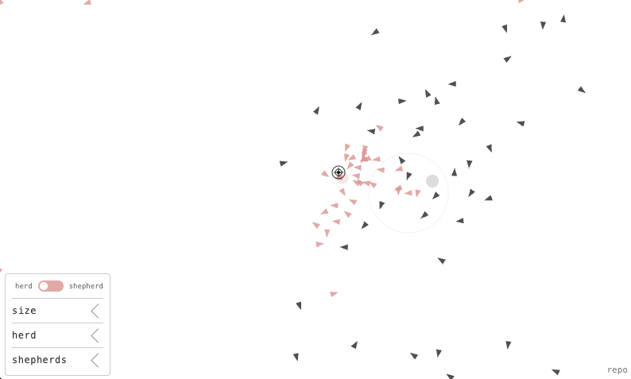

# Web Shepherd

An interactive web app demonstrating shepherding behaviour. 

Click [here](https://tjards.github.io/web_shepherd/) to access.

## References

Implemented using the technique described in:

Van Havermaet, S., Simoens, P., Landgraf, T., & Khaluf, Y. (2023). [Steering herds away from dangers in dynamic environments](https://doi.org/10.1098/rsos.230015). *Royal Society Open Science*, 10(5), 230015.

Interface inspired by the work of [Nick Frosst](https://nickfrosst.com/).