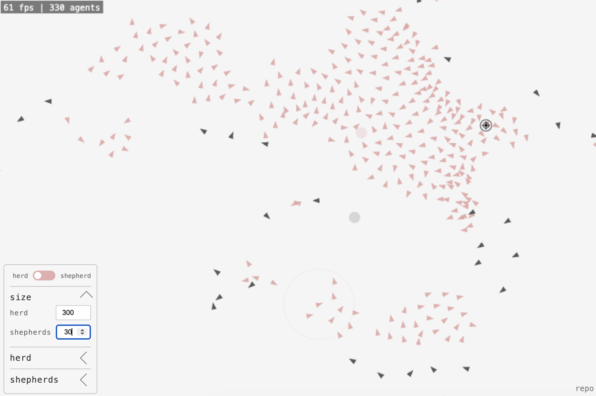

# Web Shepherd

- An interactive web app demonstrating shepherding behaviour. 
- Thank you to [OldCrow](https://github.com/OldCrow) for the significant improvements in efficiency documented [here](docs/OPTIMIZATION.md).
- Click [here](https://tjards.github.io/web_shepherd/) to access.

### References

- Van Havermaet, S., Simoens, P., Landgraf, T., & Khaluf, Y. (2023). [Steering herds away from dangers in dynamic environments](https://doi.org/10.1098/rsos.230015). *Royal Society Open Science*, 10(5), 230015.
- Interface inspired by the work of [Nick Frosst](https://nickfrosst.com/).